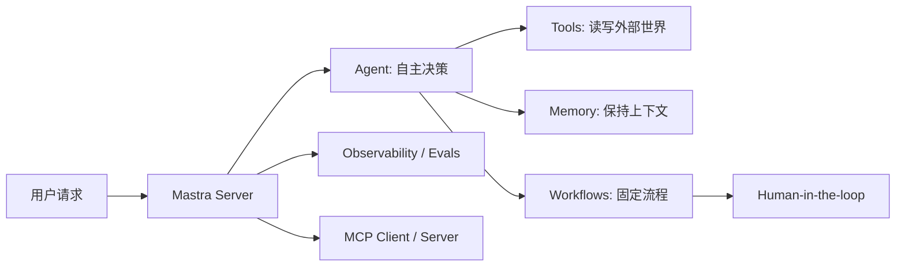

# Mastra 中文教程

Mastra 是一个面向现代 TypeScript 技术栈的 AI 应用与 agent 框架。它把模型路由、Agent、Tool、Workflow、Memory、RAG、MCP、评测和观测放在同一个工程模型里，让你从原型走到生产时不必频繁更换框架。

这本教程的目标不是把官方文档翻译成中文，而是回答一个更实用的问题：

> 如果我要用 Mastra 做一个真实 AI 产品，应该按什么顺序学习，应该怎么组织代码，哪些能力要尽早设计，哪些能力可以后置？

## 先看一张图

## 推荐阅读路径

如果你是第一次接触 Mastra，从第一部开始读，跟着 `examples/travel-concierge` 跑一遍。

如果你已经能写基础 agent，直接进入第二部：

- 想让 agent 调 API：读 Tool 设计。
- 想让任务流程可控：读 Workflow 编排。
- 想做多轮对话：读 Memory。
- 想接外部工具生态：读 MCP。
- 想让输出进入 UI 或后续流程：读结构化输出与流式。
- 想做多租户、权限和动态配置：读 RequestContext。
- 想拆分复杂任务：读多 Agent 协作。

如果你准备上线，先读第三部，尤其是观测、评测、Guardrails、安全和部署。

## 本教程的判断标准

本教程会持续强调几个工程判断：

- Agent 适合开放任务，Workflow 适合固定流程。
- Tool 应该小而精，输入输出必须有 schema。
- Memory 不是越多越好，先确定 thread 和 resource 的边界。
- RAG 不是把文档塞进 prompt，而是把检索、切块、嵌入、重排和引用做成系统。
- MCP 是插件边界，不是普通函数调用的替代品。
- 结构化输出解决输出形状，不解决业务正确性。
- 多 Agent 只有在角色边界清晰时才值得引入。
- 生产化 agent 必须可观测、可评测、可回放。

## 当前版本基线

本教程在 2026-05-28 校准了以下来源，并在 2026-06-10 把配套示例项目升级到当时的最新稳定版：

| 项目 | 版本或来源 |
| - | - |
| Mastra 仓库 | `mastra-ai/mastra@ad911714f6be2538b8bd20afac50221c388ec65c` |
| `@mastra/core` | `1.41.0` |
| `mastra` CLI | `1.12.2` |
| `@mastra/memory` | `1.20.2` |
| `@mastra/mcp` | `1.9.1` |

完整来源见 [资料来源](appendix/C-sources.md)。
