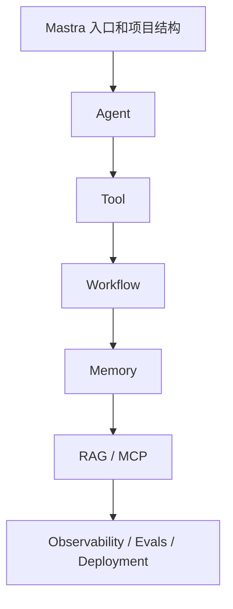

# 0. Mastra 是什么

Mastra 是一个 TypeScript-first 的 AI 应用框架。它的核心目标不是“帮你调用一次大模型”，而是把一个 AI 产品常见的工程部件放进同一套开发体验里。

这些部件包括：

- 模型路由：用统一写法连接 OpenAI、Anthropic、Google 等供应商。
- Agent：让模型根据目标自主选择工具、循环思考并给出结果。
- Tool：把你的函数、API、数据库、文件系统等能力变成模型可调用的结构化操作。
- Workflow：把确定性的多步骤流程建成可观测、可恢复的图。
- Memory：保存会话、用户偏好和长期上下文。
- RAG：把外部知识检索进 agent 上下文。
- MCP：接入外部工具生态，或把自己的能力暴露给其他 MCP 客户端。
- Evals 和 Observability：评测行为质量，追踪真实执行过程。

## Mastra 不只是 Agent 框架

很多人第一次看到 Mastra，会把它理解成“一个写 Agent 的库”。这个理解不算错，但不完整。

更准确的说法是：

> Mastra 是一个 AI 应用运行时，Agent 只是其中一种执行单元。

同一个 Mastra 项目里可以同时有：

- 一个负责开放问答的 Agent。
- 一个负责订单审核的 Workflow。
- 一个暴露给 Claude、Codex 或其他客户端的 MCP Server。
- 一套记录工具调用、模型输出和评测分数的观测链路。

## 什么时候应该用 Mastra

适合使用 Mastra 的场景：

- 你用 TypeScript 写后端或全栈应用。
- 你的 agent 需要调用多个工具，而不是只聊天。
- 你需要清楚地区分“模型自主决策”和“业务固定流程”。
- 你希望在开发阶段用 Studio 调试 agent、tool、workflow。
- 你计划上线，需要追踪、评测、存储、记忆和部署。

不一定需要 Mastra 的场景：

- 你只想调用一次 LLM API 生成文本。
- 你完全不需要工具、记忆、工作流或观测。
- 你的团队主要使用 Python，并且已经围绕其他框架建立了完整栈。

## 和常见方案的区别

| 方案 | 更适合 | Mastra 的区别 |
| - | - | - |
| 直接 OpenAI/Anthropic SDK | 单次调用、极简服务 | Mastra 提供 Agent、Tool、Workflow、Memory 等上层结构 |
| Vercel AI SDK | 前端流式 UI、模型调用抽象 | Mastra 更偏 agent 应用运行时，可与 AI SDK UI 搭配 |
| LangChain / LangGraph | Python 生态、图编排、跨语言生态 | Mastra 更贴近 TypeScript 项目和现代 JS 工程 |
| 自研 agent loop | 高度定制 | Mastra 减少重复造轮子，并提供 Studio、Memory、MCP、评测和观测 |

## 最小代码长什么样

一个最小 Agent 通常只需要两部分：定义 agent，注册到 Mastra。

```ts title="src/mastra/agents/assistant-agent.ts"
import { Agent } from '@mastra/core/agent'

export const assistantAgent = new Agent({
  id: 'assistant-agent',
  name: 'Assistant Agent',
  instructions: 'You are a helpful assistant.',
  model: 'openai/gpt-4o-mini',
})
```

```ts title="src/mastra/index.ts"
import { Mastra } from '@mastra/core'
import { assistantAgent } from './agents/assistant-agent'

export const mastra = new Mastra({
  agents: { assistantAgent },
})
```

这里有三个关键点：

- `id` 是运行时标识。生产项目里要保持稳定。
- `instructions` 是系统级行为约束，不要把业务状态硬编码在这里。
- `model` 使用 `provider/model-name` 的形式，便于切换供应商。

## 学习路线

本教程建议按这个顺序理解 Mastra：



这个顺序不是功能强弱排序，而是工程依赖排序。Tool 和 Workflow 写清楚之后，Memory、RAG、MCP 才不容易变成一团无法排查的黑盒。

