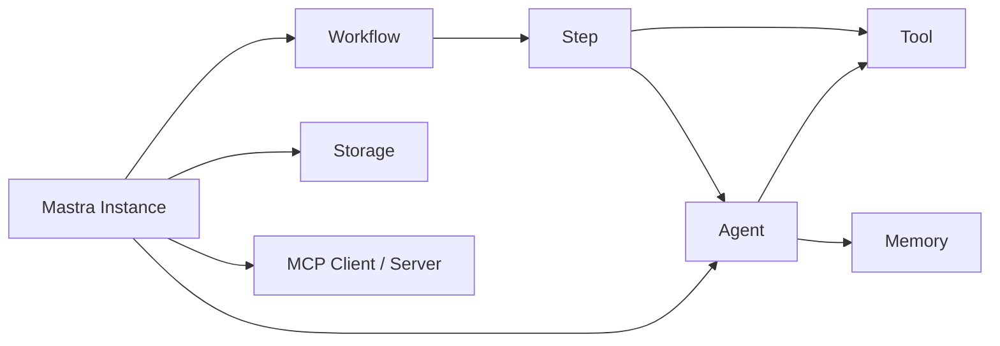
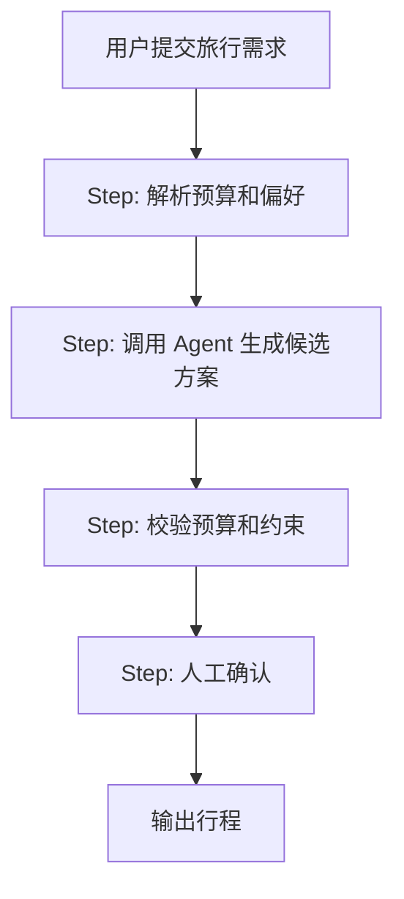

# 1. 核心心智模型

Mastra 最重要的心智模型是：把 AI 应用拆成不同执行单元，而不是把所有能力都塞进一个 prompt。

## 五个核心对象



### Mastra Instance

`new Mastra({ ... })` 是项目入口。你在这里注册 agents、workflows、storage、MCP servers、processors、observability 等能力。

一个常见误区是直接 import 某个 agent 来调用。官方文档建议通过 Mastra 实例获取已注册 agent，因为这样 agent 能拿到实例级 storage、logger、registry、observability 等共享资源。

### Agent

Agent 负责开放任务。它接收目标、读取上下文、选择工具、可能多轮调用，直到模型认为可以给出最终答案。

适合 Agent 的任务：

- 用户问题不固定。
- 工具调用顺序不确定。
- 需要模型判断是否继续探索。
- 输出可能是自然语言、结构化对象或二者组合。

### Tool

Tool 是模型能调用的函数边界。它必须有清晰描述，最好有输入输出 schema。

好的 Tool 像 API endpoint：职责小、参数明确、返回稳定。差的 Tool 像“万能执行器”：参数模糊、返回随意、权限过大。

### Workflow

Workflow 负责确定性流程。它由 `createStep()` 定义步骤，再用 `createWorkflow()` 组合。

适合 Workflow 的任务：

- 步骤顺序明确。
- 中间结果需要检查或持久化。
- 需要并行、分支、暂停、恢复、重试。
- 需要在 Studio 或日志里看到完整执行图。

### Memory

Memory 负责跨请求保存上下文。它不是 prompt 的替代品，也不是数据库的替代品。

你需要先想清楚：

- `resource` 表示谁或哪个业务实体。
- `thread` 表示哪一次会话或任务。
- 哪些信息应该成为工作记忆。
- 哪些历史只需要语义召回。
- 哪些内容必须受权限边界隔离。

## Agent 和 Workflow 的边界

最实用的判断是：

| 问题 | 用 Agent | 用 Workflow |
| - | - | - |
| “下一步该做什么”是否需要模型判断 | 是 | 否 |
| 执行顺序是否固定 | 不固定 | 固定 |
| 是否需要精确审计每一步 | 可以，但不如 Workflow 清晰 | 是 |
| 是否需要分支、并行、暂停恢复 | 可做但不优雅 | 是 |
| 是否适合自然语言对话 | 是 | 通常作为后端过程 |

常见组合方式是：Workflow 负责主流程，某些 Step 内调用 Agent 做开放判断。



## Tool 不是插件市场

Tool 是 agent 和外部世界之间的最小可控边界。你应该把 Tool 设计成“可被模型稳定选择”的能力，而不是把内部服务全量暴露出去。

一个好的 Tool 描述应该回答：

- 它什么时候该被调用？
- 输入字段代表什么？
- 返回值是否足够让模型继续推理？
- 是否有副作用？
- 是否需要人工审批？

如果一个 Tool 会写数据库、发邮件、下单、删除资源，应该明确加审批或权限边界。

## MCP 是跨系统边界

MCP 有两个方向：

- `MCPClient`：Mastra agent 连接外部 MCP server，获得第三方工具、资源、prompt。
- `MCPServer`：你的 Mastra 应用把 agents、tools、workflows 暴露给其他 MCP 客户端。

简单说：

```text
想用别人提供的工具 -> MCPClient
想让别人调用你的能力 -> MCPServer
```

如果只是项目内部函数调用，不需要 MCP。MCP 的价值在跨进程、跨语言、跨应用的工具生态边界。

## 生产化心智模型

上线一个 agent，不是把 demo 部署到服务器。你至少要能回答：

- 这次回答调用了哪些工具？
- 每个工具输入输出是什么？
- 消耗了多少 token？
- 是否触发了记忆？
- 是否使用了 RAG 结果？
- 如果回答错了，如何复现？
- 如何自动评测质量是否退化？
- 哪些操作需要人工批准？

Mastra 的观测和评测能力正是为这些问题服务的。

