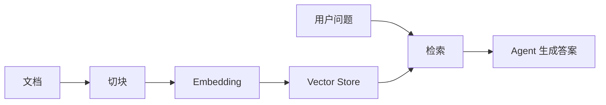
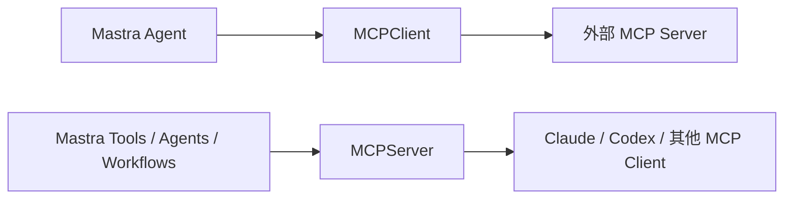

# 8. RAG 与 MCP

RAG 和 MCP 都是给 agent 扩展上下文与能力，但它们解决的问题不同。

- RAG：从你的知识库中检索相关内容。
- MCP：连接外部工具、资源和 prompt，或把你的能力暴露给其他客户端。

## RAG 的位置

RAG 不是“把文档贴进 prompt”。一个完整 RAG 流程通常包括：



Mastra 提供文档切块、向量查询工具、Graph RAG 等能力。实际项目里你需要关注：

- 文档来源是否可信。
- chunk 大小是否适合模型。
- embedding 模型是否和语言匹配。
- 检索结果是否需要重排。
- 答案是否需要引用来源。
- 用户权限是否会影响可检索文档。

## RAG 适合什么

适合：

- 帮客服 agent 查询知识库。
- 帮代码 agent 查询内部规范。
- 帮法务或财务 assistant 查询制度文档。
- 帮销售 agent 查询产品资料。

不适合：

- 实时状态查询。用 Tool 查数据库或 API。
- 强一致业务逻辑。用 Tool 或 Workflow。
- 需要修改外部系统的操作。用 Tool，并加权限。

## MCP 的两个方向

Mastra 支持两个核心类：

- `MCPClient`：连接外部 MCP server，拿到工具、资源、prompt。
- `MCPServer`：把你的 Mastra tools、agents、workflows 暴露给外部 MCP 客户端。



## 连接外部 MCP Server

```ts title="src/mastra/mcp/search-client.ts"
import { MCPClient } from '@mastra/mcp'

export const searchMcpClient = new MCPClient({
  id: 'search-mcp-client',
  servers: {
    wikipedia: {
      command: 'npx',
      args: ['-y', 'wikipedia-mcp'],
    },
  },
})
```

把 MCP 工具交给 agent：

```ts title="src/mastra/agents/research-agent.ts"
import { Agent } from '@mastra/core/agent'
import { searchMcpClient } from '../mcp/search-client'

export const researchAgent = new Agent({
  id: 'research-agent',
  name: 'Research Agent',
  instructions: '使用可用 MCP 工具查找背景资料，并用中文总结。',
  model: 'openai/gpt-4o-mini',
  tools: await searchMcpClient.listTools(),
})
```

这种静态写法适合个人工具、CLI 或单租户服务。

## 多租户场景用动态 toolsets

如果不同用户有不同 MCP 凭据，不要在 agent 初始化时写死工具。可以在请求时构造 MCPClient，并把 `listToolsets()` 传给 `.generate()` 或 `.stream()`。

```ts
const userMcp = new MCPClient({
  servers: {
    privateSearch: {
      url: new URL('https://example.com/mcp'),
      requestInit: {
        headers: {
          Authorization: `Bearer ${userToken}`,
        },
      },
    },
  },
})

const response = await agent.generate(userPrompt, {
  toolsets: await userMcp.listToolsets(),
})

await userMcp.disconnect()
```

这能避免把所有用户共享同一套外部工具凭据。

## 暴露自己的 MCP Server

```ts title="src/mastra/mcp/travel-mcp-server.ts"
import { MCPServer } from '@mastra/mcp'
import { travelAgent } from '../agents/travel-agent'
import { itineraryWorkflow } from '../workflows/itinerary-workflow'
import { cityWeatherTool } from '../tools/city-weather-tool'

export const travelMcpServer = new MCPServer({
  id: 'travel-mcp-server',
  name: 'Travel MCP Server',
  version: '1.0.0',
  agents: { travelAgent },
  workflows: { itineraryWorkflow },
  tools: { cityWeatherTool },
})
```

注册：

```ts title="src/mastra/index.ts"
import { Mastra } from '@mastra/core'
import { travelMcpServer } from './mcp/travel-mcp-server'

export const mastra = new Mastra({
  mcpServers: { travelMcpServer },
})
```

## 选择 RAG、Tool、MCP 的判断

| 需求 | 首选 |
| - | - |
| 查询自己系统里的实时业务数据 | Tool |
| 查询大量非结构化文档 | RAG |
| 调用外部 agent 工具生态 | MCPClient |
| 把自己的能力给其他 agent 用 | MCPServer |
| 固定多步骤业务流程 | Workflow |

不要把 MCP 当成内部模块系统，也不要把 RAG 当成数据库查询。

